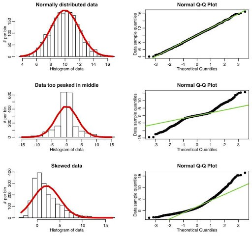
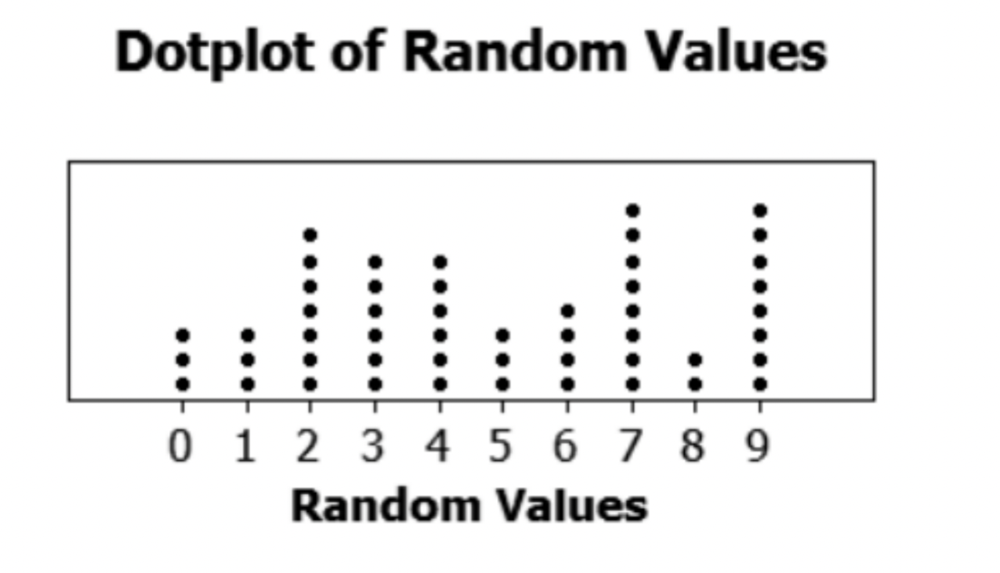
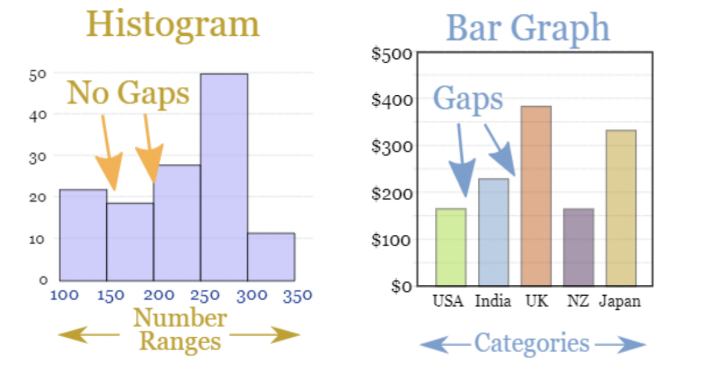
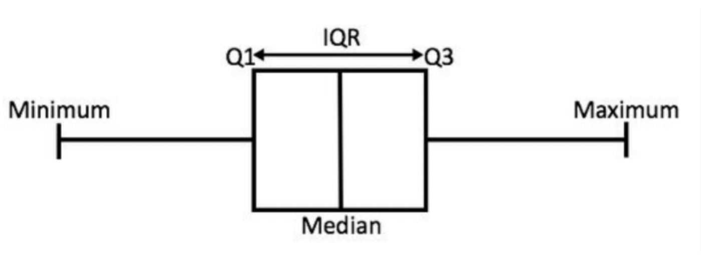
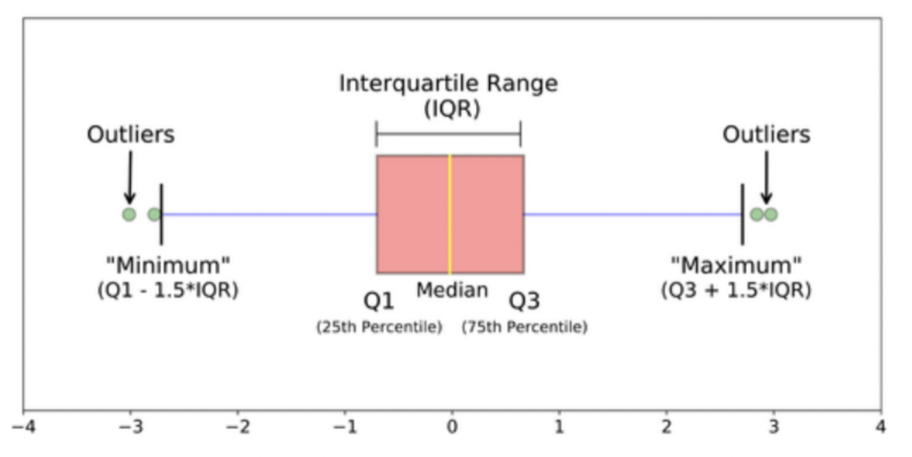

---
title: "Chapter 1B Summary"
author: "Paul Luo, Tina Wang, Jackson Cong"
date: "`r Sys.Date()`"
output: html_document
---

## QQ Plot
- qqnorm(): produces a normal QQ plot of the variable
- qqline(): adds a reference line 
  

## Investigation 1.12

- **Biased**: the statistic is an underestimate or overestimate of a population parameter
- **Unbiased**: the statistic is not an underestimate or overestimate of a population parameter
- **Simple random sample**: every observational unit in the population the same chance of being selected. 
- **Sample variability**: This can be evaluated by the standard error. Because the test implies that, as depicted over, the standard error of the mean measures the variability of the examining dispersion of the mean. At the point when tests are randomly chosen from a populace, the subsequent diffusion will be roughly ordinarily circulated for a moderate sample size of n. The following formula is used in finding the standard error of the mean.
- $SEM = s/ \sqrt{n}$ Where ‘s’ is the standard deviation and n is the number of observations.
- **Variables of interests**: These are aspects and factors which a researcher focuses on mostly to conclude their research work.

## Investigation 1.14
- **Central Limit Theorem**(CLT): The CLT states that the test's dissemination implies approximating a typical conveyance as the sample size gets bigger, no matter what the populace's circulation. When random samples are drawn from large but finite population with huge sample size, then this will mean distribution of the sample proportion $\hat{p}$ will be well modeled by a normal distribution with a mean equal to π, the population proportion of successes, and standard deviation similar to $SD (\hat{p}) =\sqrt{ π(1 − π)}/n$. We consider the sample size large enough if $nπ > 10$ and $n(1 − π) > 10$. We believe the population size (N) is more significant if it is more than 20 times the sample size.

## Investigation 1.15
- **Non-sampling error**: non-sampling error encompasses all mistakes entirely unconnected to sample selection. All surveys, such as censuses and administrative data, contain non-sampling errors. They can occur for various reasons, including the frame needing improvement, some participants not precisely reporting data, data needing to be included for some survey participants, and so on. When all or nearly all data for a sample group is missing, this is called a total nonresponse error. This can occur if the participant is unavailable or temporarily lacking, unable or unwilling to complete the survey, or if the abode is unoccupied.

## Investigation 1.16
- **Sampling error**: A sampling error is a statistical mistake that occurs when an analyst fails to choose a sample that accurately represents the entire data collection. A representative sample considers study discoveries to be summed up to the bigger populace and for the overview examination to be rehashed. Notwithstanding, there are a few issues that can block the viability of a sample. Characterizing the population, choosing a representative test from the populace, and leading the study, so members participate are manners to restrict review predisposition and increment generalizability. 

## Investigation 1.17

- Statistical significance alludes to the case that an outcome from information produced by testing or trial and error is likely owing to a particular reason. With substantial sample sizes, sample proportion will change little from one sample to another. Thus even little contrasts (that might appear minor to a large portion) will be genuinely critical. Saying that a sample result will probably not occur by some coincidence (and accordingly is genuinely vital) is different from saying the outcome is significant or even imperative (essentially huge), contingent upon the setting in question.

## Investigation 2.1
- **Dotplots**: shows each numerical value individually on the graph with dots (small datasets).  
  **in r:**  
  ggplot(data = \<DATA\>, mapping = aes(\<MAPPINGS\>)) +  \<GEOM_FUNCTION\>() 
  or 
  dotchart(x, labels = NULL, groups = NULL, gcolor = par(“fg”), color = par(“fg”)) 
 
  x: it is defined as numeric vector or matrix. 
  labels: a vector of labels for each point. 
  groups: a grouping variable indicating how the elements of x are grouped. 
  gcolor: color to be used for group labels and values. 
  color: the color(s) to be used for points and labels. 

- **Histograms**: a graphical representation of data points organized into user-specified ranges.  
  **in r:**  
  geom_histogram() 
  or 
  hist(data) 

- **Distributions features**：

- **Center**: a point clustered
- **Variability**: how spread out (range).

## Investigation 2.2
- **IQR** (interquartile range) = upper quartile (Q3) - lower quartile(Q1) 
 - The IQR measures the width of the interval including the middle 50% of the observations.
  
 
- **Boxplot**: graph is based on the five-number summary
  

- **Outlier** is measured according to 1.5IQR larger or smaller than Q3 and Q1
- **Modified Boxplot** marks possible outliers and reports a non-outliers observation.
- **Data transformation** is the process of converting, cleansing, and structuring data into a usable format that can be analyzed.
