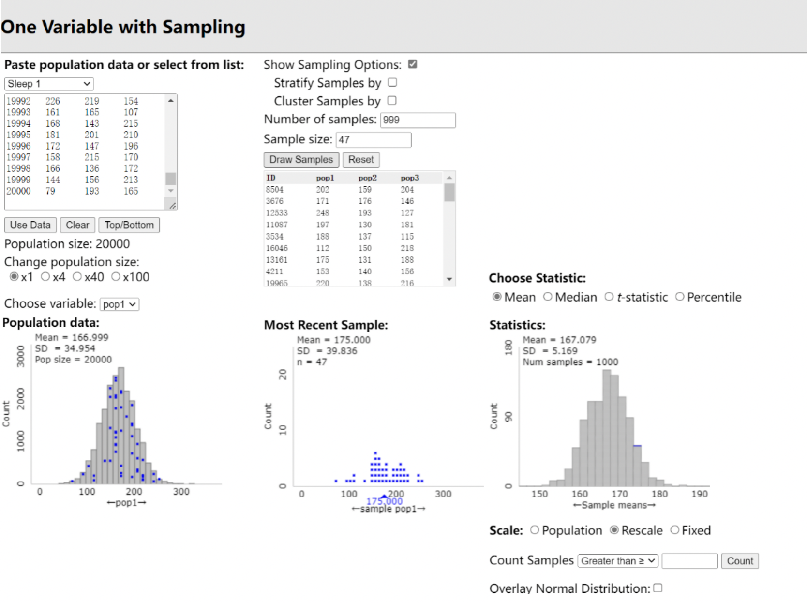

```{r setup, include=FALSE}
knitr::opts_chunk$set(echo = TRUE)
load("~/math247/ISCAM.RData")
```

# Investigation 2.4: Population Mean

- Sampling from Finite Population applet (Normal Population)

(1 Number of samples, 47 Sample size)
<br>

(1000 Number of samples, 47 Sample size)
<br>
- Non-normal Population

(Skewed to right)
<br>


(Uniform)
<br>

- The sample data come from a well-designed random population or randomized experiment of size $n$ with mean $\mu$ and standard deviation.
  + The mean will be equal to $\mu$.
  + The standard deviation is equal to $\frac{\sigma}{\sqrt{n}}$ (we can call this SD ($\bar{x}$)).
- **Central Limit Theorem**: The population has a normal distribution or the sample size is large ($n \ge 30$), the shape will be normal. If the population distribution has unknown shape and $n < 30$, use a graph of the sample data to assess the Normality of the population. Do not use t procedures if the graph shows strong skewness or outliers. 

# Investigation 2.5: t-test

- Standard deviation of statistic: $SE(\bar{x}) = \frac{s}{\sqrt{n}}$
- To test the hypothesis $H_0: \mu = \mu_0$, compute the one-sample t statistic. 
  
- Then find the P-value by calculating the probability of getting a t statistic this large or larger in the direction specified by the alternative hypothesis $H_a$ in a t distribution with df (degrees of freedom) = n – 1: 
  

- **P-Value**: The P-value is based on a t-distribution with n 1 degrees of freedom. This value can be estimated in R. 
- In R: 
  + t.test(x, mu = $\mu_0$, alternative = "two.sided", conf.level = .95)
  + iscamonesamplet(xbar, sample standard deviation(s), n, hypothesized, alternative, conf.level)
```{r}
iscamonesamplet(xbar = 98.249, sd = .733, n = 130, hypothesized = 98.6, alternative = "two.sided", conf.level = .95)
```
  + If $P < \alpha$, then Reject the $H_0$, otherwise Fail to Reject $H_0$.
- **Confidence Interval for $\mu$**. (Check the percentage of confidence interval to corresponding t-value)
  + $\bar{x} \pm t^{*}_{n-1} × (\frac{s}{\sqrt{n}})$
