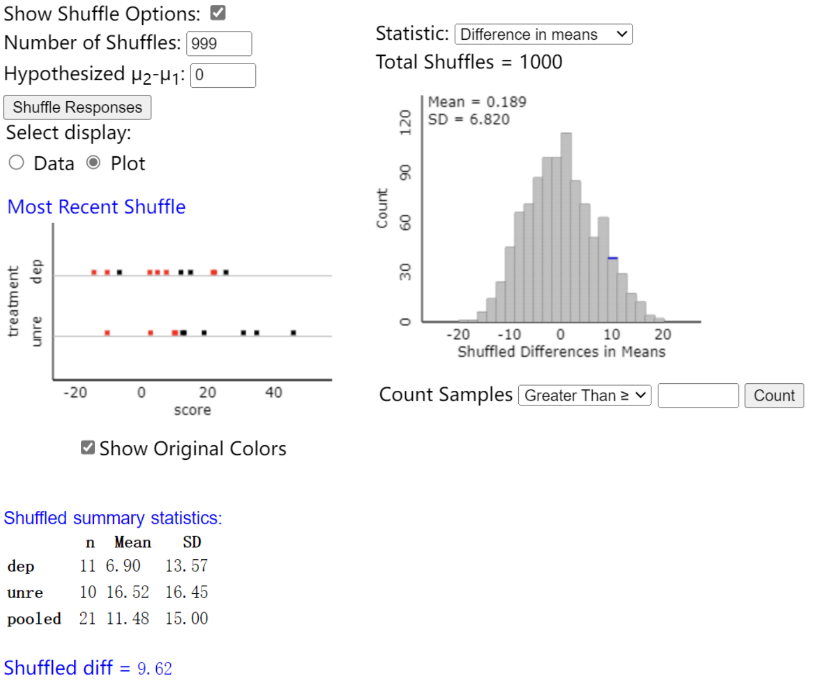

# Investigation 3.1 
- With two samples for a binary categorical variable, two-way table (2x2 table of counts) can be used.
- In R, we can input matrix(c(x, x, x, x), ncol = 2) code to construct two-way table. 
- **Conditional proportion**: Comparing proportions of two groups instead of the overall proportion. 
  - Eg. $\hat{p}_1$ − $\hat{p}_2$
  
  - According to the formula, Variability is easily calculated from $\hat{p}_1$ and $\hat{p}_2$2. 
- **Central Limit Theorem for the difference in two sample proportions**
  - Two independent samples $n_1$ and $n_2$ from large populations, the distribution of difference of $\hat{p}_1$ − $\hat{p}_2$ is approximately normal. The mean equals to $\pi_1$ – $\pi_2$. Standard deviation equals to SD($\hat{p}_1$ − $\hat{p}_2$).
  - We consider the sample size is large enough to make a normal model if: $n_1\pi_1 \ge 5$,  $n_1(1-\pi_1)\ge 5$, $n_2\pi_2 \ge 5$, $n_2(1-\pi_2) \ge 5$
- Two proportion t-test in r: iscamtwopropztest($observed_1$, $n_1$, $observed_2$, $n_2$, hypothesized difference, alt = (“less”, “greater”, or “two.sided”), conf.level = 0.95)
- Confidence interval formula of two proportion
  
- **The table from The Statistical Sleuth**
  - Random sampling enhances the external validity or generalizability of your results, because it helps ensure that your sample is unbiased and representative of the whole population.
  - Random sampling is a way of selecting members of a population to be included in the study. Random assignment is a way of sorting the samples into control and experimental groups.
  - **Random sampling** + **Random assignment**: Random sample is selected in population, and units are distributed randomly into groups. 
  - **Random sampling** + **Not Random assignment**: Random samples from populations, the inferences can be generalized to populations.
  - **Not Random sampling** + **Random assignment**: Units of sample are randomly assigned, which can draw cause and effect conclusions. 
  - **Not Random sampling** + **Not Random assignment**: Available units and assigned into irregular groups, which results in confounding variables and potential sampling bias.

# Investigation 3.5
- **P-value with random assignment (Dolphin therapy group and control group)**
  - With Dolphin Study Applet, 1000 numbers of shuffles, 13 blue and 17 green. Mean = 6.499
    
# Investigation 4.2 
- **Comparing two population means**: Choose an SRS of size $n_1$ from Population 1 with mean $µ_1$ and standard deviation $σ_1$ and an independent SRS of size $n_2$ from Population 2 with mean $µ_2$ and standard deviation $σ_2$
  - The sampling distribution of $\bar{x}_1 - \bar{x}_2$ is **Normal** if both population distributions are Normal.
  - The mean of the sampling distribution of is $\bar{x}_1 - \bar{x}_2$ is $µ_{\bar{x}_1 - \bar{x}_2}$ = $µ_1$ - $µ_2$
  - The standard deviation of the sampling distribution of $\bar{x}_1 - \bar{x}_2$ is $SD_{\bar{x}_1 - \bar{x}_2}$ = $\sqrt{(σ^2_1/n_1)+(σ^2_2/n_2)}$
  - $C$% confidence interval for $µ_1$ – $µ_2$ is ($\bar{x}_1 - \bar{x}_2$) $\pm t$*$\sqrt{(s^2_1/n_1)+(s^2_2/n_2)}$
  - where $t$* is the critical value with $C$% of the area between –$t$* and $t$* for the $t$ distribution with degrees of freedom (n-1)
  - Valid condition: the sample distributions are reasonably symmetric or the sample sizes are both at least 20
  - In R, two sample t-test: iscamtwosamplet($x_1$, $sd_1$, $n_1$, $x_2$, $sd_2$, $n_2$, alt= “less”, “greater”, or “two.sided”, conf.level)
# Investigation 4.4 
- **Simulating a Randomization Test for a Quantitative Response**
  - Comparing Groups (Quantitative) applet:
    
  - The dotplots in picture shows how two groups of people distributed after 1000 shuffles. (Two groups represent deprived and unrestricted sleeping of people)
  - For exact P-value, thinking about all possible random assignments of units distributed into groups, and determining difference in means or medians. Then, counting how many of the simulated statistics or as or more extreme as the observed.
  - In R: 
  
