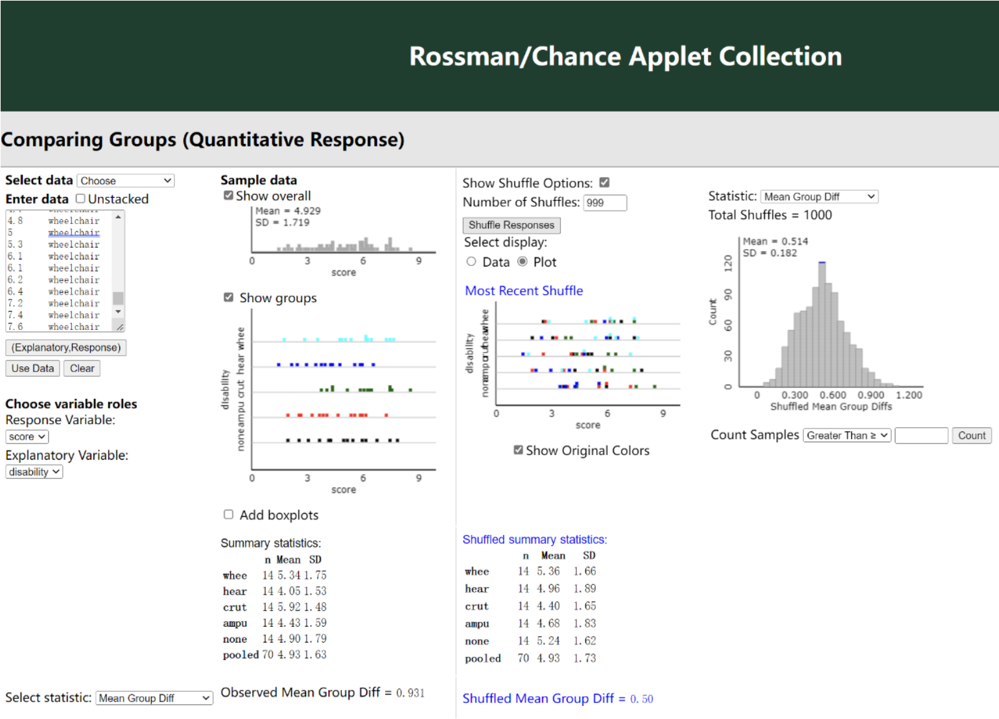
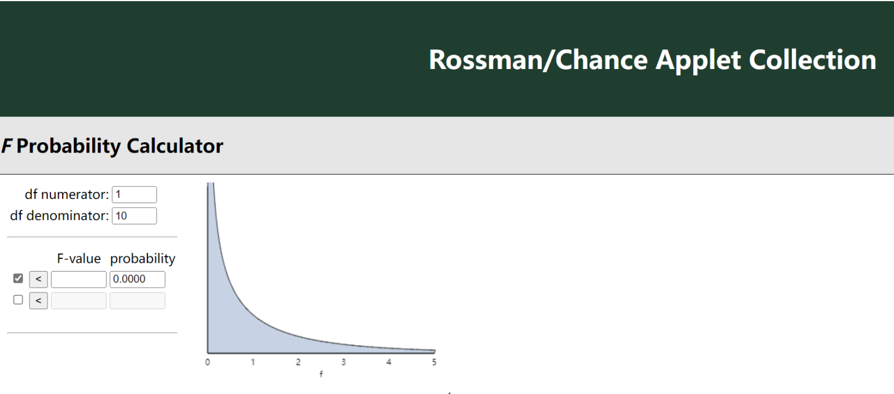
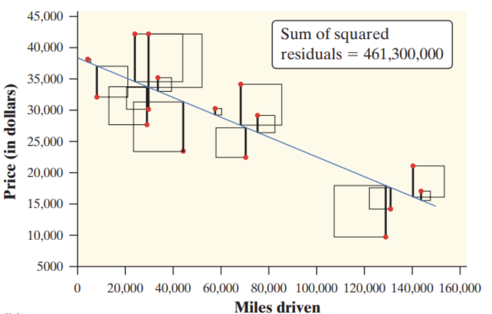
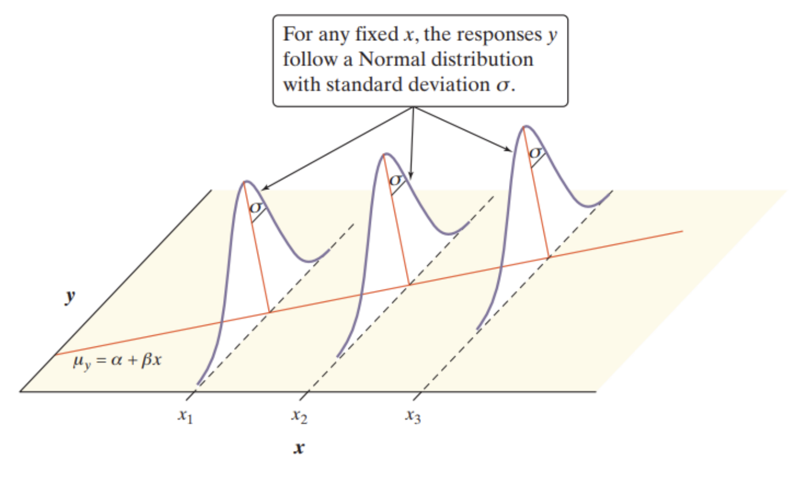

```{r setup, include=FALSE}
knitr::opts_chunk$set(echo = TRUE)
load("~/math247/ISCAM.RData")
```

# Investigation 5.4
- **Target**: Comparing two or more population means (eg. independent random samples)
- Examples in text book with **Comparing Groups (Quantitative) applet and raw material** “www.rossmanchance.com/iscam2/data/DisabilityEmployment.txt”:

- The Sample number, Mean and SD are shown in the picture.
- The formula to calculate the weighted variance of variability between groups: $\frac{n_1(\bar{x}_1 - \bar{x})^2 + n_2(\bar{x}_2 - \bar{x})^2 + n_3(\bar{x}_3 - \bar{x})^2 + n_4(\bar{x}_4 - \bar{x})^2 + n_5(\bar{x}_5 - \bar{x})^2}{5-1}$
- If the sample size is not equal, the formula will be: $S^2_p = \frac{(n_1 - 1)s_1^2 + (n_2 - 1)s_2^2 + (n_3 - 1)s_3^2 + (n_4 - 1)s_4^2 + (n_5 - 1)s_5^2}{(n_1 - 1) + (n_2 - 1) + (n_3 - 1) + (n_4 - 1) + (n_5 - 1)}$
- When The denominator simplifies to n – I,
  - n is the total number of observations in the data set
  - I is the number of groups being compared 
  
- **Analysis of Variance (ANOVA)** formula
  - F = between-group variability / within-group variability
  - Technical conditions required for F distribution applying:
    - The distribution for each group comes from a normal population.
    - Same population SD for all the groups.
    - Independent observations
  - Example of process:
    - $H_0$: There is no treatment effect *or* $H_0$: $\mu_1$ = … = $\mu_I$ 
    - $H_a$: There is a treatment effect *or* $H_a$: at least one i differs from the rest
- **SSgroups**(sum of squares for groups):
  - Checking the sum of the squared deviations of the group means to the overall mean, and the mean is weighted according to the sample size.    
  - SSgroups = $\sum_{i= 1}^{I} n_i(\bar{x}_i - \bar{x})^2$
- **MSgroups**(mean square for groups):
	 - Averaging values according to the groups involved.
	 - MSgroups = $\frac{SSgroups}{I-1}$
- **MSE**(mean squares for error): 
  - MSE = $\frac{\sum_{i= 1}^{I} (n_i - 1)s_i^2}{n-I}$ which has $n-I$ degrees of freedom.
- The test statistics is
  - $F = \frac{MSgroups}{MSE}$
  - Then the p-value comes from F distribution with $I − 1$ and $n − I$ degrees of freedom


# Investigation 5.5
- Target: Calculating p-value from F-statistics
  - Using **F probability Calculator applet**, filling in degrees of freedom and the observed F-value, and the direction for the probability of interest. 
  
  - In R: pf(x, df1, df2, lower.tail=FALSE)

# Investigation 5.6
- Target: Analyzing data set with two quantitative variables and describing the relationship between them, the following procedure is taking the data of “jump cat”. 
  - To read jump cat data, in R:
```{r}
cats.jumping <- read.csv("http://www.rossmanchance.com/iscam2/data/CatJumping.txt", sep = "")
```
  - Then displaying first three data in head
```{r}
head(cats.jumping, n = 3)
```

  - Input linear model and regression equation
```{r}
cats.model <- lm(velocity ~ percentbodyfat, data = cats.jumping) 
cats.model
```
  - (We are taking y as velocity of cats and x is the percent of body fat.)
  - Check the model with residuals
```{r}
residuals <- cats.model$residuals
hist(residuals) 
qqnorm(residuals)
```
# Investigation 5.8
- **Regression line**: a line that describes how a response variable y changes as an explanatory variable x change, and a regression line is used to predict the value of y for a given value of x.
- **Residual**: the difference between an observed value of the response variable and the value predicted by the regression line. 
  - $residual_i = y_i - \hat{y}_i$
- The **least-squares regression line** of y on x is the line that makes the sum of the squared residuals as small as possible. 

  - $\hat{y} = b_0 + b_1x$
  - Coefficients $b_0$ is y intercept, and $b_1$ is sample slop. 
  - $SSE = \sum (y_i - \hat{y}_i)^2 = \sum_{i= 1}^{n} (y_i - b_0 - b_1x_i)^2$
  - **SSE** is sum of squares error, and the error is the difference between the *observed* value and the *predicted* value. We usually want to minimize the error because the smaller the error, the better the estimation power of the regression. 
  - In R, to calculate intercept and slope: lm(response~explanatory)
  - To then superimpose regression line on scatterplot: abline(lm(response~explanatory))
- **Basic regression model**
  - Conditions:
    - The actual relationship between x and y is linear. For any fixed value of x, the mean response y falls on the regression line E(Y at each x) = $\beta_0 + \beta_1x$. 
    - The standard deviation of y (call it s) is the same for all values of x. 
    - For any fixed value of x, the response y varies according to a Normal distribution.
    
# Investigation 5.13
- Prediction Intervals in R
```{r}
predict(lm(velocity ~ percentbodyfat, data = cats.jumping), newdata=data.frame(percentbodyfat=25), interval="prediction")
```
- Confidence interval for slop$\beta$
  - CI = statistic $\pm$ (critical value)(standard deviation of statistic)
  - CI = $b \pm t*SE_b$
- When the conditions for inference are met, we can use the slope b of the sample regression line to construct a confidence interval for the slope b of the regression line
- Confidence intervals and significance tests for the slope b of the population regression line are based on a t distribution with n -2 degrees of freedom, so the formula below is taken:
  - $s = \sqrt{\frac{\sum(residuals)^2}{n-2}}$
- $H_0$: $\beta = \beta_0$, then the t interval for the slope $\beta$ is: 
  - $t = \frac{b - \beta_0}{SE_b}$
- Standard Error
  - $SE(b_1) = s\sqrt{\frac{1}{(n-1)s^2_x}}$
